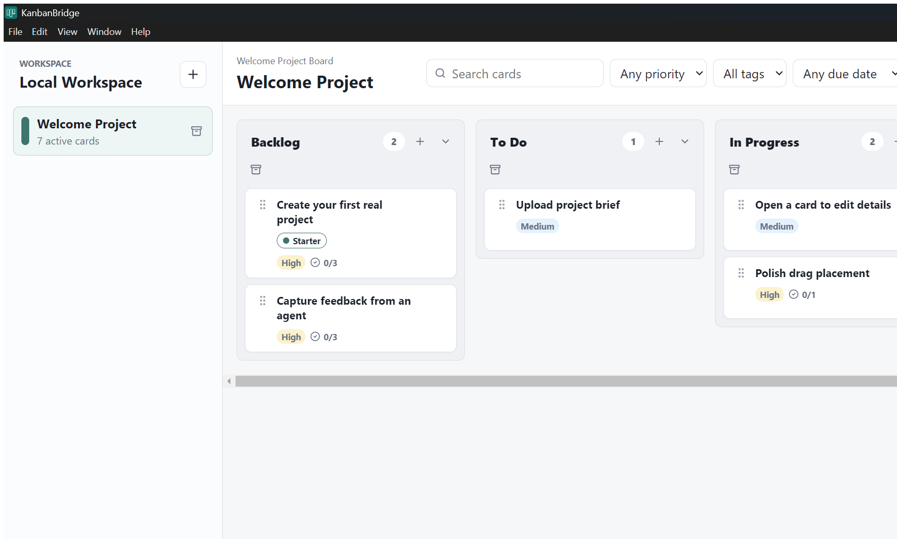

<div align="center">
  <h1>KanbanBridge</h1>
  <p><strong>A local-first Kanban board with a connector for coding agents.</strong></p>
  <p>
    Plan work in a familiar desktop board, capture observations as they happen,
    and let Codex, Claude Code, Cursor, or another local agent keep the board
    updated while implementation work moves forward.
  </p>
</div>

<p align="center">
  
</p>

## What It Is

KanbanBridge is a Windows desktop app for managing project work in local Kanban-style boards. It keeps your project data on your machine, supports observations and planning artifacts, and exposes a guarded local connector for coding agents.

It is meant for the workflow where you are steering a project, noticing issues, turning those observations into real backlog work, and asking agents to move cards as they implement changes.

## Why It Exists

Traditional boards are good at organizing work for people. Coding agents are good at doing implementation work. KanbanBridge connects those two loops without requiring a hosted service, a cloud workspace, or agents editing the database directly.

- Track projects, columns, cards, priorities, due dates, tags, checklists, comments, and history.
- Capture raw observations one at a time, then convert them into linked backlog cards.
- Let local agents add observations, create cards, update cards, and move work through the board.
- Require explicit project targeting so agents do not accidentally update the wrong project.
- Store planning documents, screenshots, mockups, and design assets with the project.
- Create local manual backups from the desktop app.
- Build a normal Windows app and desktop shortcut that opens without a terminal window.

## Typical Workflow

1. Create a project for the thing you are building.
2. Add observations when something feels wrong, missing, confusing, or worth improving.
3. Convert observations into actionable backlog cards, linked back to their source observation.
4. Have Codex, Claude Code, Cursor, or another agent work one card at a time.
5. Let the agent move cards across the board as work goes from Backlog to Review to Done.

## Quick Start

If you use Codex, Claude Code, Cursor, or another coding agent, you can likely download the repo and ask the agent to set up and run KanbanBridge for you. The manual commands are included below for anyone who wants to run the setup directly.

Install dependencies:

```powershell
pnpm install
```

Run in development mode:

```powershell
pnpm dev
```

Build and run the production app:

```powershell
pnpm build
pnpm start
```

Build the Windows desktop app and desktop shortcut:

```powershell
pnpm install:desktop
```

The packaged app is written to:

```text
desktop-release/win-unpacked/KanbanBridge.exe
```

## Agent Connector

KanbanBridge runs a local connector while the desktop app is open:

```text
http://127.0.0.1:38731
```

Start by listing projects:

```powershell
node scripts/agent-bridge.mjs projects
```

Create an observation:

```powershell
node scripts/agent-bridge.mjs observe "Dragging cards feels too jumpy" `
  --source codex `
  --project-name "My Project"
```

Create a card linked to an observation:

```powershell
node scripts/agent-bridge.mjs card "Smooth card dragging" `
  --project-name "My Project" `
  --column Backlog `
  --priority High `
  --observation-id <observation-id> `
  --checklist "Reproduce issue|Adjust drag target math|Verify build"
```

Move a card:

```powershell
node scripts/agent-bridge.mjs move-card <card-id> `
  --project-name "My Project" `
  --column "In Progress"
```

Card mutation commands require `--project-id` or `--project-name`. If an agent omits the target, the connector refuses the request instead of guessing from the active UI.

See [AGENT_CONNECTOR.md](AGENT_CONNECTOR.md) for the full CLI and HTTP API.

## Local Data

KanbanBridge stores runtime data outside the repository:

```text
%LOCALAPPDATA%\ProjectBoard\workspace.sqlite
```

Manual backups are written to:

```text
%LOCALAPPDATA%\ProjectBoard\backups\manual\
```

The `ProjectBoard` folder name is retained for compatibility with earlier local builds. Build output, local databases, environment files, logs, installers, shortcuts, and archives are ignored by Git.

## Tech Stack

- Electron
- React
- TypeScript
- dnd-kit
- sql.js / SQLite
- electron-builder

## Status

KanbanBridge is an early local-first desktop app. The core board, observation workflow, planning document upload flow, design asset flow, manual backups, and local agent connector are implemented, but the project is still evolving.

## License

KanbanBridge is open source under the [MIT License](LICENSE).
